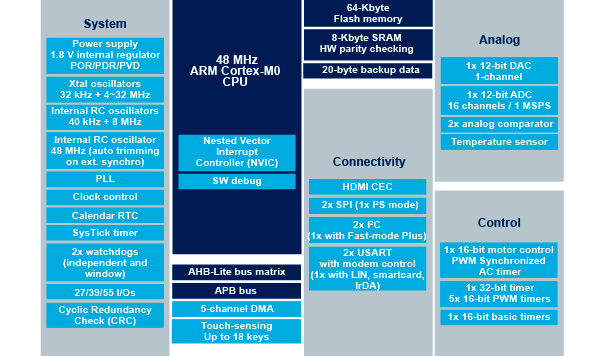
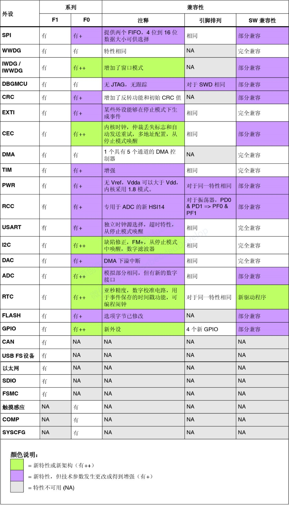
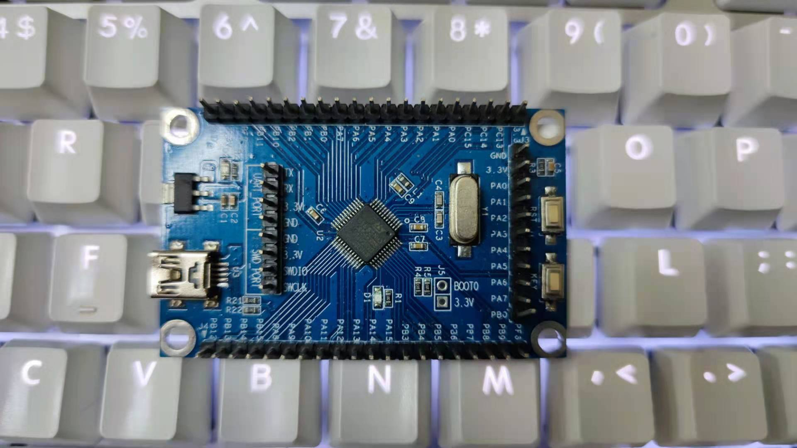

# [STM32F051](https://github.com/SoCXin/STM32F051)

* [ST](https://www.st.com/zh/): [Cortex-M0](https://github.com/SoCXin/Cortex)
* [L3R3](https://github.com/SoCXin/Level): 48 MHz (38DMIPS/106CoreMark)

## [描述](https://github.com/SoCXin/STM32F051)

[STM32F051](https://github.com/SoCXin/STM32F051)意法半导体基于ARM Cortex®-M0的STM32 F0系列单片机实现了32位性能，同时传承了STM32系列的重要特性，特别适合成本敏感型应用。

### 关键特性

* 12bit DAC
* 12bit ADC
* HDMI CEC接口

### [资源收录](https://github.com/SoCXin)

* [参考资源](src/)
* [参考文档](docs/)
* [参考工程](project/)

### [选型建议](https://github.com/SoCXin)

STM32F051x0超值系列在传统8位和16位市场极具竞争力，并可使用户免于不同架构平台迁徙和相关开发带来的额外工作。STM32F051x1系列MCU实现了高度的功能集成，提供多种存储容量和封装的选择，为成本敏感型应用带来了更加灵活的选择。

[STM32F0系列](https://www.st.com/zh/microcontrollers-microprocessors/stm32f0-series.html)与[STM32F1系列](https://www.st.com/zh/microcontrollers-microprocessors/stm32f1-series.html)外设兼容性：

### 相关开发板

### [探索芯世界 www.SoC.xin](http://www.SoC.Xin)
